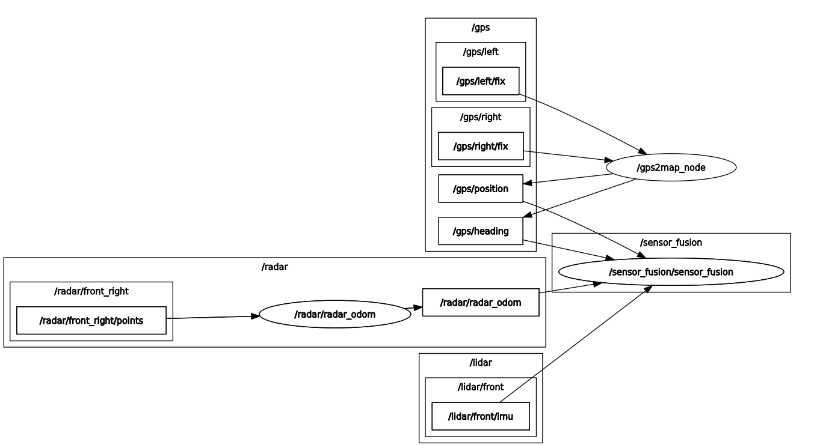

# DTU_thesis

This is the repository for my 2022 MSc thesis at DTU named "Resilient Farmland Navigation through Sensor Fusion and Condition Monitoring".

The overall concept is to develop a 3-stage algorithm that:
1. Performs Radar Odometry using a doppler radar based on Kellner's algorithm [1]
2. Performs Sensor Fusion using an Error State Extended Kalman Filter [2]
3. Performs Condition Monitoring using a Generalized Likelihood Ratio test to detect sensor failures [2]

# Structure

- In the subfolder 'assets', you can find several result plots, along with the most essential literature and my actual thesis report.
- In the subfolder 'prototype', you can find the notebooks that were used to develop and experiment with the used algorithms using Python.
- In the subfolder 'ros2', you can find the Ros 2, C++ deliverable packages for the mobile robot on which data collection was performed.

# Data

The data are proprietary so they cannot be provided.

# Results

## Outlier-resistant Radar Odometry

The successful outlier (moving targets) rejection based on the SSE of the radial speed residuals (theoretical vs measured) can be seen in the following plot:

The detected (circled) outliers are then excluded from the radar odometry estimation.

## Sensor Fusion

The successful Sensor Fusion with an ESEKF can be seen in the following plots:

| Radar + IMU  | GPS (every 40 seconds) + Radar + IMU | GPS + Radar + IMU|
| ------------- | ------------- | ---------- |
| | ||

## GLRT change detection

- Change detection was tested under 3 different types of sensor faults (small ramp, big ramp, spoofing). 
- The heading velocity residuals were found to best fit a Student's t distribution.
- To have a probability of false alarm 1 / 30 days using the Student's t cumulative density function, the Sliding window was experimentally chosen to be 40 and the GLRT statistic was chosen to be ~3

| Sensor Faults  | Residuals Distribution | Residuals Under Fault | GLRT statistic | Fault Detection |
| ------------- | ------------- | ---------- | ------ | ------------- |
|  || ||  |

## Final

The final trajectory result is the following:

| trajectory - small ramp  | trajectory - big ramp | trajectory - spoofing |
| ------------- | ------------- | ---------- |
| | |  |

**TLDR** The vehicle moves, then GPS spoofing is introduced, then the algorithm successfully detects it and disables the GPS, then rolls back the vehicle state and continues using only the radar odometry estimates coupled with the IMU, then the algorithm finally detects that the defect no longer exists, and finally it re-integrates the GPS to the sensor fusion to enable even more robust vehicle localization.

# ROS 2

Briefly, 3 seperate packages were delivered:
- /ros2/radar_odom implements the proposed Radar Odometry velocity estimation and performs outlier rejection
- /ros2/sensor_fusion implements
    - an Error State Extended Kalman Filter to perform sensor fusion between GPS, IMU, and Radar
    - a sliding-window change detection algorithm based on the Generalized Likelihood Ratio Test (GLRT)
- /ros2/custom_msgs implements necessary Ros 2 messsages for inter-node communication

The node architecture of the delivered C++ Ros 2 nodes can be seen in the following RQT Graph:

# Future Work

In the future, a 3-way voting system can be introduced for more robust change detection using Radar Odometry, Visual Odometry, and GPS.

# Literature

The most important literature for the project was the following:

1. Instantaneous Ego-Motion Estimation using Doppler Radar (Kellner et. al., 2013)
3. Quaternion kinematics for the error-state Kalman filter (Sola, 2017)
2. Diagnosis and Fault-Tollerant Control (Blanke et. al., 2016)
    - Specifically chapter 6.7 - Stochastic model - change detection algorithms